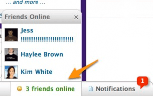

!SLIDE subsection transition=cover

# Example Application

!SLIDE incremental bullets

# Online Site Presence
* You've got a site with users
* Your users have friends
* Your users what to see if their friends are online
* You want speed, and aren't in the mood for a web of *SQL fun*.

!SLIDE center transition=fade

# Or put more simply.

!SLIDE incremental bullets
# Redis Data Sets to the Rescue!
* Have one active set per minute. 
* On incoming web request, add the user's ID to the active set
* Union the last 5 sets for a collection of user IDs seen in past 5 minutes.

!SLIDE bullets smaller
* Example implementation courtesy of Luke Melia of Weplay Sports (http://weplay.com)
* http://www.lukemelia.com/blog/archives/2010/01/17/redis-in-practice-whos-online/

!SLIDE code small

    @@@RUBY
    
    require "active_support"

    # Defining the keys
    def key(minute)
      "online_users_minute_#{minute}"
    end

    def current_key
      key(Time.now.strftime("%M"))
    end

    def keys_in_last_5_minutes
      now = Time.now
      times = (0..5).collect {|n| now - n.minutes }
      times.collect{ |t| key(t.strftime("%M")) }
    end

    # online_users_minute_37
    # online_users_minute_36
    # [...]
    # online_users_minute_32

!SLIDE code

    @@@RUBY

    # Tracking an Active User

    def track_user_id(id)
      key = current_key
      redis.sadd(key, id)
    end
    
!SLIDE code

    @@@RUBY

    # Who's online

    def online_user_ids
      redis.sunion(*keys_in_last_5_minutes)
    end

    def online_friend_ids(interested_user_id)
      redis.sunionstore("online_users", *keys_in_last_5_minutes)
      redis.sinter("online_users", "user:#{interested_user_id}:friend_ids")
    end