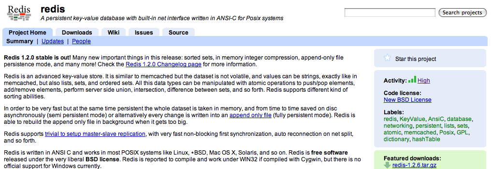

!SLIDE subsection transition=cover

# What is Redis?

!SLIDE center transition=scrollUp

# No, not that!

!SLIDE incremental bullets

# Redis Is...

* An advanced key-value store
* Similar to memcached but the dataset is non-volatile...
* ...distinct from memcached in that it supports advanced datatypes beyond strings

!SLIDE incremental bullets

# Datatypes, you say?

* Strings
* Lists
* Sets
* Sorted sets

!SLIDE center transition=blindX

# Sampling of Redis Commands

!SLIDE incremental bullets smbullets

# Operating on Strings

* **SET** - set a key to a string value
* **GET** - return the string value of the key
* **GETSET** - set a key to a string returning the old value
* **MGET** - multi-get, return the values of multiple keys
* **SETNX** - set a key to a string value if the key does not exist
* **INCR** - increment the integer value of key (atomically) 
* **DECR** - decrement the integer value of key (atomically)
## ...and more!

!SLIDE incremental bullets smbullets

# Operating on Lists

* **LPUSH**/**RPUSH** - append an element to the head or tail of the list
* **LLEN** - return the length of the list
* **LRANGE** - return a range of elements
* **LTRIM** - trim the list to the specified range of elements
* **LPOP**/**RPOP** - return and remove (atomically) the first or last element
## ...and *way* more!

!SLIDE incremental bullets smbullets

# Operating on Sets

* **SADD**/**SREM** - add/remove the specified member to the set value at key
* **SISMEMBER** - test if the specified value is a member of the set at key
* **SINTER** - intersection between the sets stored at key1, key2, ...keyN
* **SUNION** - return the union between the sets stored
* **SDIFF** - return the difference between the sets
* **SRANDMEMBER** - a random member of the set value at key
## ... :iceberg => "tip"

!SLIDE small

# For a full command reference see 
## http://code.google.com/p/redis/wiki/CommandReference

!SLIDE incremental bullets transition=fade

# So what's cool about this?
* It often closely models our beloved Ruby classes; think Array#pop, shift, +, etc.
* May require less cognitive overhead for some tasks.
* It's very fast.

!SLIDE incremental bullets transition=scrollLeft smbullets

# How fast is Redis?
###*or, why people like Redis

* Tested with redis-benchmark
* 50 simultaneous clients, 100,000 requests, using loopback
* SET and GET with 256 bytes string
* Linux 2.6 on a Xeon X3320 2.5Ghz
* About 110,000 SETs per second, and 81,000 GETs per second

!SLIDE bullets

# Running Redis

* Linux, BSD, Mac OS X, Solaris
* No official support for Windows
* Root privs not needed to get started

!SLIDE center

## http://code.google.com/p/redis/
### Also on github: http://github.com/antirez/redis

!SLIDE transition=fade

#Client Support

##**Ruby**, Python, Twisted Python, PHP, Erlang, Tcl, Perl, Lua, Java, Scala, Clojure, C#, C, Javascript/Node.js

!SLIDE incremental bullets

# Other points of interest

* Supports master/slave replication
* Written in ANSI C, easy to compile and install
* Past work sponsored by Engine Yard & Citrusbyte
* Currently sponsored by VMWare

!SLIDE bullets smbullets incremental

# Future enhancements

* Currently, sharding is accomplished via consistent hashing.
* However, this makes it tough/impossible to add servers into the mix.
* Redis cluster will support adding and removing nodes while the system is running.
* Cluster is the top priority after the release of Redis 2.0.

!SLIDE bullets incremental

# Who is using Redis?

* Engine Yard
* Craigslist
* Guardian.uk
* Ruby Minds
* Github
* You?
