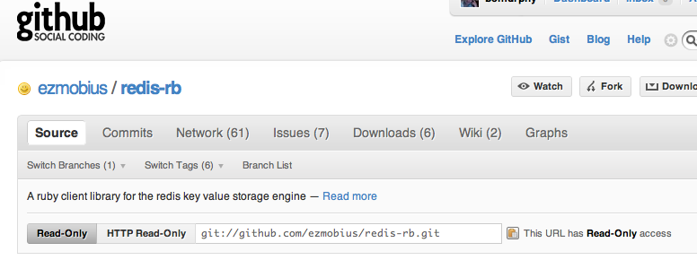

!SLIDE subsection

# Getting Ruby on Redis

!SLIDE center

## It's on github, of course!

!SLIDE commandline incremental

## Quick Start

    $ sudo gem install ezmobius-redis-rb
    
    $ /path/to/redis-server
    11 Apr 21:10:31 - Server started, Redis version 1.2.6
    11 Apr 21:10:32 - DB loaded from disk
    11 Apr 21:10:32 - The server is now ready to accept connections on port 6379
    11 Apr 21:10:32 . DB 0: 75535 keys (0 volatile) in 131072 slots HT.
    11 Apr 21:10:32 . 0 clients connected (0 slaves), 24243472 bytes in use, 0 shared objects

    $ irb
    >> require "redis"
    => true
    >> redis = Redis.new
    => #<Redis:0x113d4e4 @host="127.0.0.1", @timeout=5, @sock=#<TCPSocket:0x113d46c>, db0, port6379
    >> redis.set("foo", "bar")
    => true
    >> redis.get("foo")
    => "bar"
