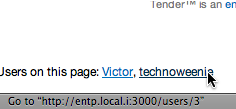

!SLIDE subsection transition=cover

# Redis in the Wild

!SLIDE bullets

# Retwis-RB

* An example Twitter-like application using the Redis key-value database.
* http://github.com/danlucraft/retwis-rb

!SLIDE bullets smbullets incremental

# scanty-redis

* Fork of the lightweight sinatra blog app, scanty.
* http://adam.blog.heroku.com/past/2009/7/13/scanty_on_redis/
* "But I also like to look at the weight of the dependencies. Using Redis meant that I dropped 12,000 lines of the vendored Sequel ORM, and replaced it with the 600 line redis-rb library and the 5,000 line JSON gem."

!SLIDE smbullets

# Resque

* Resque is a Redis-backed Ruby library for creating background jobs, placing those jobs on multiple queues, and processing them later.  Github replaced the use of DelayedJob with Resque for queuing background jobs.
* http://github.com/defunkt/resque
* http://sfruby-meetup-resque.heroku.com/

!SLIDE smbullets

# Where's waldo

* Track what users are on which pages with redis & node.js
* Using a snippet of javascript at the bottom of your site, you can end up with something like this:
* 
* http://github.com/technoweenie/wheres-waldo